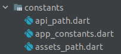
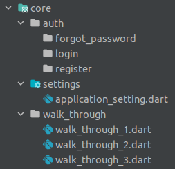
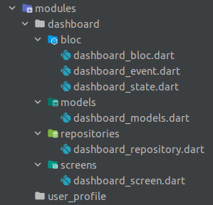
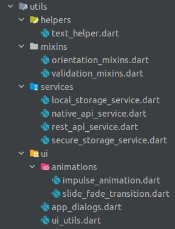

## Author
```
[Prarup Gurung](https://github.com/grgprarup)
Email: grgprarup@gmail.com
Organization: Code Zero Pvt. Ltd.
[Organizational Website](https://codezeronepal.com)
[Personal Website](https://www.prarupgurung.com.np)
```

# Medical Recorder

<p>This is a flutter based application. This application is used to store the details of the patients, the doctors and the nurses. Also the records of the patients history are stored. Further more analysis of records will be done.</p>

## Features

### Patient Details
    - Add Patient
    - Edit Patient
    - Delete Patient
    - View Patient
    - Search Patient
    - Export Patient
    - Import Patient

### Doctor Details
    - Add Doctor
    - Edit Doctor
    - Delete Doctor
    - View Doctor
    - Search Doctor
    - Export Doctor
    - Import Doctor

### Nurse Details
    - Add Nurse
    - Edit Nurse
    - Delete Nurse
    - View Nurse
    - Search Nurse
    - Export Nurse
    - Import Nurse

## Installation

## Project Structure


### Config

#### Routes
#### Themes

### Constants


### Core

#### Auth
#### Settings
#### Walk_through

### Modules

#### Dashboard
##### Bloc
##### Models
##### Repositories
##### Screens

### Utils

#### Helpers
#### Mixins
#### Services
#### Ui
##### Animations

### Widgets

## Usage

## Tests

## Future Work

## Version History

## Contributing Guidelines

## License

## References
For help getting started with Flutter development, view the
[online documentation](https://docs.flutter.dev/), which offers tutorials,
samples, guidance on mobile development, and a full API reference.
